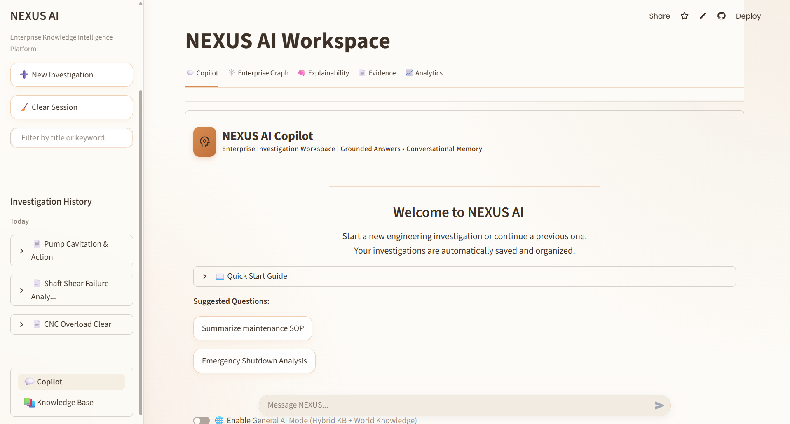
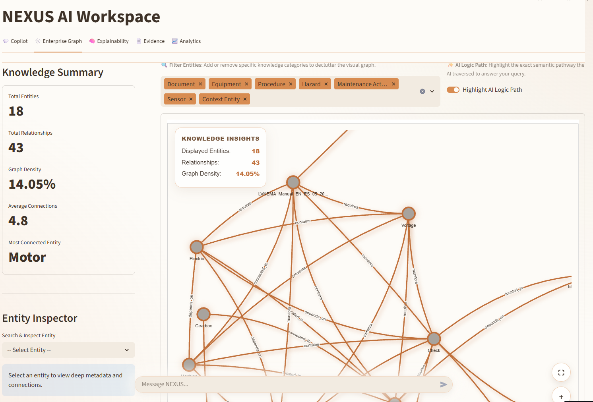
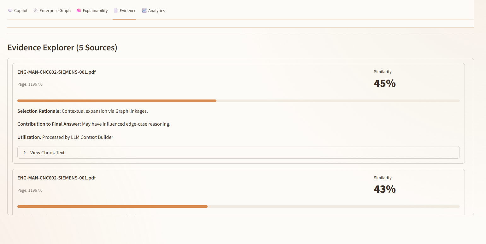
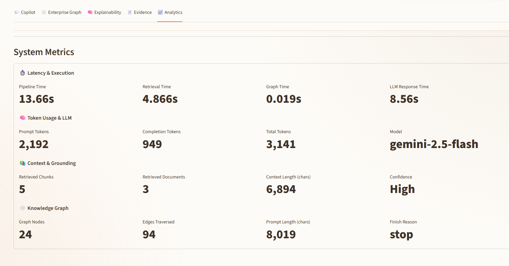
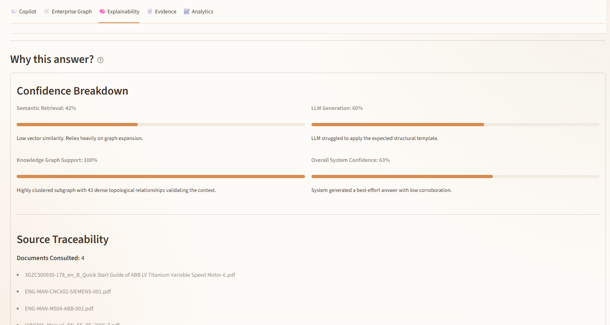
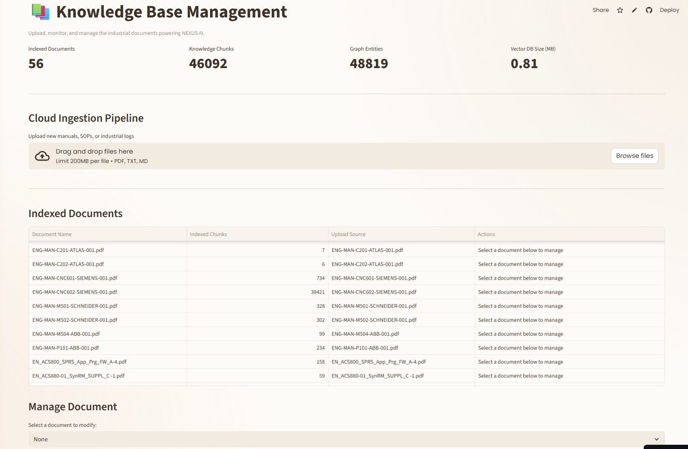

# 🚀 NEXUS AI – Enterprise GraphRAG Investigation Copilot

> An enterprise-grade AI investigation workspace that combines **Retrieval-Augmented Generation (RAG)**, **Knowledge Graph reasoning**, and **Explainable AI** to provide grounded, evidence-backed answers for industrial engineering documentation.


---

## 📌 Project Overview

NEXUS AI is an **Enterprise GraphRAG Copilot** designed for industrial environments where AI responses must be **accurate, explainable, and traceable**.

Unlike traditional chatbots, NEXUS AI combines:

- 📚 Semantic Vector Search (FAISS)
- 🕸️ Knowledge Graph Reasoning
- 🤖 Large Language Models (OpenRouter)
- 📄 Evidence-backed Responses
- 📊 Live Analytics
- 🔍 Explainability
- 💾 Investigation Memory

The result is an AI assistant capable of answering engineering questions using retrieved enterprise documentation instead of relying solely on model memory.

---

# ✨ Key Features

## 🤖 Enterprise AI Copilot

- Intelligent engineering assistant
- Context-aware conversations
- Investigation memory
- Follow-up question generation

---

## 🔎 GraphRAG Pipeline

- Semantic retrieval using FAISS
- Knowledge Graph expansion
- Context enrichment
- Grounded LLM generation

---

## 🕸️ Knowledge Graph

- Entity extraction
- Relationship mapping
- Graph traversal
- Connected reasoning

---

## 📄 Evidence Explorer

Every answer includes:

- Source documents
- Similarity scores
- Page references
- Supporting document chunks

---

## 🧠 Explainability

The system explains:

- Why documents were selected
- How answers were generated
- Graph reasoning path
- Confidence estimation

---

## 📊 Analytics Dashboard

Live pipeline metrics including:

- Pipeline latency
- Retrieval time
- Graph expansion time
- LLM latency
- Token usage
- Retrieved chunks
- Graph statistics

---

## 💾 Investigation History

- Persistent investigations
- Conversation restoration
- Stored telemetry
- Historical analysis

---

# 🏗️ System Architecture

```
                User
                  │
                  ▼
        Streamlit Enterprise UI
                  │
                  ▼
         Query Processing Layer
                  │
                  ▼
       FAISS Vector Retrieval
                  │
                  ▼
     Knowledge Graph Expansion
                  │
                  ▼
        Context Construction
                  │
                  ▼
          OpenRouter LLM
                  │
                  ▼
      Structured AI Response
                  │
      ┌───────────┼───────────┐
      ▼           ▼           ▼
  Evidence    Explainability  Analytics
```

---

# ⚙️ Technology Stack

| Category | Technologies |
|-----------|-------------|
| Language | Python |
| Frontend | Streamlit |
| LLM | OpenRouter |
| Embeddings | Sentence Transformers |
| Vector Database | FAISS |
| Knowledge Graph | NetworkX |
| Database | SQLite |
| Data Processing | Pandas, NumPy |
| Visualization | Plotly |
| NLP | spaCy |

---

# 📂 Project Structure

```
NEXUS-AI/
│
├── app.py
├── components/
├── services/
├── utils/
├── styles/
├── data/
│   ├── chunks/
│   ├── vector_db/
│   ├── knowledge_graph/
│   └── investigations.db
│
├── assets/
├── requirements.txt
├── runtime.txt
└── README.md
```

---

# 🚀 Installation

Clone the repository

```bash
git clone https://github.com/ACT2039/industrial-ai-copilot.git
```

Move into the project

```bash
cd <YOUR_REPOSITORY>
```

Install dependencies

```bash
pip install -r requirements.txt
```

Run the application

```bash
streamlit run app.py
```

---

# 💻 Demo

## Live Application

> **Streamlit:** *https://industrial-ai-copilot-eev59jhrmun9niwltdx88h.streamlit.app*


---

## GitHub Repository

```
https://github.com/ACT2039/industrial-ai-copilot
```

---

# 📸 Screenshots

## Enterprise Copilot Dashboard



---

## Knowledge Graph



---

## Evidence Explorer



---

## Analytics Dashboard



---

## Source Traceability Diagram



---

## Knowledge Base Management Dashboard



---

# 🔄 Application Workflow

```
User Question
      │
      ▼
Semantic Retrieval
      │
      ▼
Knowledge Graph Expansion
      │
      ▼
Context Builder
      │
      ▼
OpenRouter LLM
      │
      ▼
Grounded Response
      │
      ▼
Evidence + Analytics
```

---

# 🎯 Use Cases

- Industrial Maintenance
- Failure Analysis
- SOP Retrieval
- Equipment Troubleshooting
- Engineering Knowledge Search
- Manufacturing Documentation

---

# 🔮 Future Enhancements

- Multi-user authentication
- OCR document ingestion
- Incremental indexing
- Multi-modal GraphRAG
- Enterprise RBAC
- Cloud vector database
- Agentic workflows

---

# 👨‍💻 Author

**Charan Teja Arangi**

B.Tech Computer Science Engineering

GitHub: https://github.com/ACT2039

LinkedIn: https://www.linkedin.com/in/charantej2039/
---

# 📄 License

This project is licensed under the MIT License.

---

⭐ If you found this project useful, consider giving it a star.
