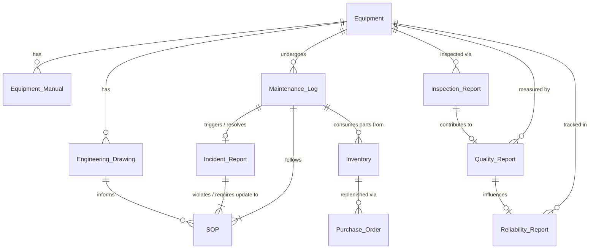
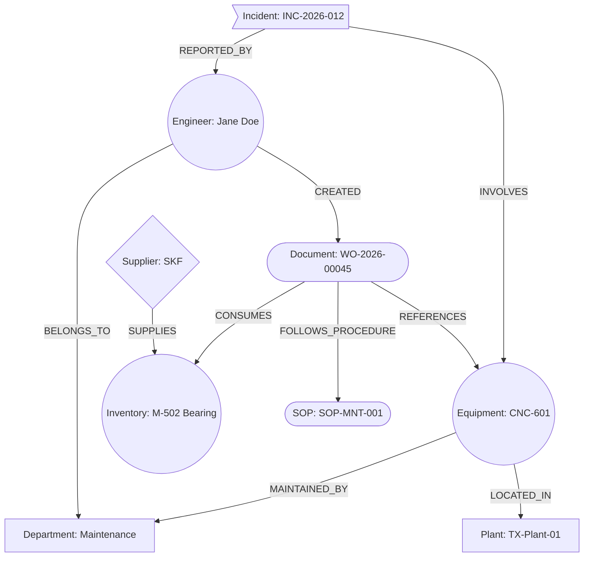

# Nexus Industrial Corp. - Enterprise Data Architecture

> [!NOTE]
> **Confidentiality Level:** Enterprise Internal
> **Document Purpose:** Defines the Data Lake Architecture, Metadata Schemas, Knowledge Graph Ontology, and implementation strategy for the Nexus Industrial Corp. Unified Asset & Operations Brain.

---

## 1. Enterprise Data Lake Architecture

The Nexus AI Data Lake follows a robust, multi-tiered architecture designed to handle 20+ years of legacy industrial data while simultaneously streaming real-time IoT telemetry. 

### 1.1 Raw Layer (Bronze)
- **Purpose:** The immutable landing zone for all incoming data. It stores exact, unaltered copies of source documents, manuals, and sensor dumps in their native formats (PDF, DOCX, CSV, JPEG).
- **Function:** Serves as the ultimate source of truth and recovery point if downstream processing fails. No transformations occur here.

### 1.2 Processed Layer (Silver)
- **Purpose:** The structured and standardized data zone. Here, raw unstructured data is converted into clean, machine-readable formats.
- **Function:** Performs OCR (Optical Character Recognition) on scanned PDFs, translates proprietary formats to standard JSON/Markdown, standardizes dates and units, and normalizes tabular data.

### 1.3 Curated Layer (Gold)
- **Purpose:** The business-ready data zone. Data here is enriched, joined, and modeled for specific business domains.
- **Function:** Consolidates isolated data points (e.g., joining an Equipment ID from a maintenance log with its corresponding Engineering Drawing and OEM manual). This layer powers traditional BI dashboards.

### 1.4 AI Layer
- **Purpose:** The foundation for Machine Learning and Large Language Models.
- **Function:** Generates and stores vector embeddings, tokenized text chunks for RAG (Retrieval-Augmented Generation), and fine-tuning datasets tailored for our industrial foundation models.

### 1.5 Knowledge Layer
- **Purpose:** The semantic understanding engine.
- **Function:** Hosts the Enterprise Knowledge Graph (EKG). It extracts entities (Equipment, Engineers, Parts) and relationships (Maintained_By, Consumes) from the Processed Layer, allowing the AI to logically reason across disconnected documents.

### 1.6 Analytics Layer
- **Purpose:** The presentation and interaction tier.
- **Function:** Serves the AI Copilot UI, traditional BI tools (PowerBI/Tableau), and external APIs. This layer accesses the Knowledge and AI layers to answer complex natural language queries.

---

## 2. Enterprise Folder Structure

The underlying storage system (e.g., S3/ADLS) is organized hierarchically to support scalable data governance and RBAC (Role-Based Access Control).

```text
/nexus-ai-data-lake
├── /raw                        # Immutable source files
│   ├── /manuals                # OEM Equipment Manuals
│   ├── /maintenance            # PM logs, Work Orders, Breakdown reports
│   ├── /inspection             # Quality and NDT inspection reports
│   ├── /quality                # NCRs, Control Plans, Audit reports
│   ├── /incident               # EHS incident and near-miss reports
│   ├── /safety                 # SOPs, Risk Assessments, MSDS
│   ├── /engineering            # Equipment specs, MOCs
│   ├── /drawings               # P&IDs, CAD exports (PDF/DXF)
│   ├── /inventory              # Spare parts catalogs, cycle counts
│   ├── /procurement            # POs, Vendor Contracts
│   ├── /reliability            # RCM, FMEA, RCA analysis
│   ├── /production             # Batch records, Shift handover logs
│   └── /images                 # Thermal images, defect photos
├── /processed                  # Cleaned, standardized data
│   ├── /ocr                    # Text extracted from scanned documents
│   └── /metadata               # Global metadata.csv manifests
├── /ai_layer                   # Model-ready data
│   ├── /embeddings             # Pre-computed dense vectors
│   └── /vector_db              # Snapshots of vector database indices
├── /knowledge_graph            # RDF/Cypher export files for the EKG
├── /analytics                  # BI and Copilot facing
│   ├── /evaluation             # Ground-truth datasets for AI testing
│   ├── /logs                   # Copilot query and feedback logs
│   └── /exports                # Reports generated by the AI
└── /archive                    # Cold storage for compliance/retention
```

### Why this structure exists:
This strict partitioning separates concerns. The `raw` folder is categorized by domain to allow department-level access control. AI preprocessing pipelines pull from `raw`, output text to `ocr`, update `metadata`, generate `embeddings`, and map relationships into the `knowledge_graph`.

---

## 3. File Naming Standards

To enable programmatic parsing and robust metadata extraction, all ingested files must follow the Nexus standard convention:

**Format:** `<DeptCode>-<DocTypeCode>-<Year>-<Sequence>.<Extension>`

### Examples:
- **`MNT-WO-2026-00045.pdf`**
  - **`MNT`**: Department (Maintenance)
  - **`WO`**: Document Type (Work Order)
  - **`2026`**: Year of Creation
  - **`00045`**: Sequential Identifier
- **`EHS-SOP-2026-0012.pdf`**
  - **`EHS`**: Department (Environment, Health, Safety)
  - **`SOP`**: Document Type (Standard Operating Procedure)
- **`QA-INSP-2026-0102.pdf`**
  - **`QA`**: Department (Quality Assurance)
  - **`INSP`**: Document Type (Inspection Report)

---

## 4. Metadata.csv Schema

The `metadata.csv` file acts as the central registry for the Data Lake. Every file in the system must have a corresponding row here.

| Column Name | Description |
| :--- | :--- |
| **Document ID** | Unique UUID assigned during ingestion. |
| **Document Type** | Classification (e.g., Manual, Work Order, SOP, PO). |
| **Equipment ID** | Linked asset (e.g., `CNC-601`). Can be null if doc is generic. |
| **Equipment Name** | Human-readable name of the equipment. |
| **Department** | Owning business unit (e.g., Maintenance, EHS). |
| **Manufacturer** | OEM of the equipment (e.g., Siemens, FANUC). |
| **Plant** | Facility code (e.g., `TX-Plant-01`). |
| **Area** | Specific zone within the plant (e.g., `Machining Zone`). |
| **Revision** | Document version number (e.g., `v2.1`). |
| **Language** | Document language (e.g., `EN`, `DE`). |
| **Source** | Origin system (e.g., `SAP_EAM`, `SharePoint`, `Local_Upload`). |
| **Created Date** | Original document creation timestamp. |
| **Updated Date** | Last modification timestamp. |
| **OCR Required** | Boolean (`TRUE`/`FALSE`). Flags if the file is a scanned image. |
| **Embedding Generated** | Boolean. Flags if the file has been vectorized for RAG. |
| **Knowledge Graph Extracted** | Boolean. Flags if entities have been mapped to the EKG. |
| **Tags** | Comma-separated list of key topics (e.g., `hydraulic, pump, failure`). |
| **Status** | Processing status (`Pending`, `Processed`, `Archived`, `Error`). |
| **Owner** | Email or User ID of the primary document custodian. |
| **Confidentiality** | Access level (`Public`, `Internal`, `Restricted`, `Confidential`). |
| **Retention Period** | Time (in years) the document must be legally retained. |

---

## 5. Document Relationships

Understanding the interconnectivity of industrial documents is crucial for root-cause analysis and the Copilot's reasoning abilities.



---

## 6. Enterprise Knowledge Graph (EKG) Entities

The EKG moves the AI from pure semantic search to logical reasoning.

### 6.1 Ontology
- **Node Types:** `Equipment`, `Document`, `Engineer`, `Department`, `Incident`, `Inspection`, `Maintenance`, `Supplier`, `Inventory_Part`, `Plant`, `Area`, `Work_Order`, `SOP`, `Regulation`.
- **Relationship Types:** `LOCATED_IN`, `MAINTAINED_BY`, `REFERENCES`, `CREATED`, `BELONGS_TO`, `INVOLVES`, `REPORTED_BY`, `FOLLOWS_PROCEDURE`, `CONSUMES`, `SUPPLIES`, `COMPLIES_WITH`.
- **Properties:** Every node contains properties matching the metadata schema (e.g., an Equipment Node has properties: `ID`, `Manufacturer`, `Install_Date`).

### 6.2 Example Graph Visualization



---

## 7. Implementation Recommendations

To build this platform realistically within the constraints of our hackathon/prototyping timeline, we must follow a strict data sourcing strategy.

### 7.1 What should be collected first (Phase 1 MVP)
- **Equipment Manuals:** These provide the baseline operational knowledge for the RAG system.
- **SOPs:** Essential for safety and procedural queries.
- **Work Orders:** Forms the basis for troubleshooting assistance.

### 7.2 What should be ignored (Initially)
- **Live IIoT Telemetry / SCADA data:** Highly complex and noisy. Stick to *document-based* intelligence first, integrating time-series data in Phase 3.
- **Video/CCTV feeds:** Requires heavy computer vision infrastructure outside the scope of text-based AI operations.

### 7.3 What should be simulated
- **Work Orders & Maintenance Logs:** We cannot use real proprietary breakdown data. These must be simulated to mimic real failure modes (e.g., bearing failures, hydraulic leaks).
- **Quality Non-Conformance Reports (NCR):** Simulate these based on common manufacturing defects.

### 7.4 What public datasets should be downloaded
- **OSHA Regulations:** Publicly available safety standards (Simulate them as `Safety` docs).
- **Public OEM Manuals:** Use publicly available manuals for pumps, motors, and CNC machines from manufacturers like Siemens, ABB, and Haas.
- **SDS/MSDS (Safety Data Sheets):** Freely available for common industrial chemicals and lubricants.

### 7.5 What documents can be generated synthetically (via LLMs)
- Shift Handover Logs.
- Incident Reports.
- FMEA and Root Cause Analysis reports.
*(These can be generated synthetically using LLMs instructed to act as maintenance engineers, ensuring realistic jargon and interconnected IDs are used).*

### 7.6 What information should NEVER be fabricated
- **The Knowledge Graph / Metadata Links:** The relationships between documents and equipment IDs must be strictly deterministic and logically sound. If a synthetic Work Order says it used part `BRG-992`, that part *must* exist in the synthetic Inventory ledger. Broken referential integrity will destroy the AI Copilot's reasoning ability.
