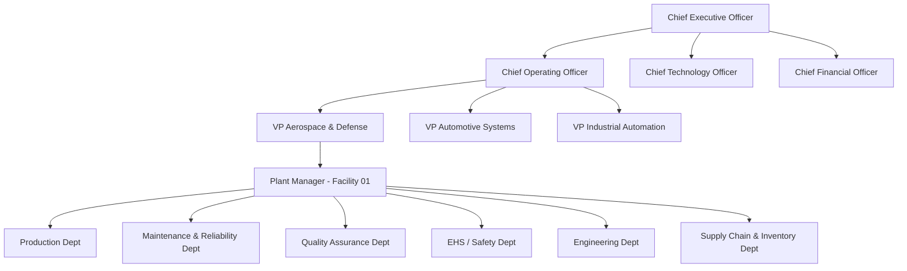
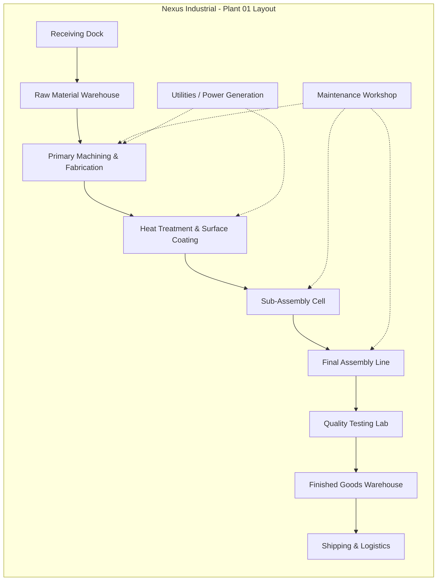
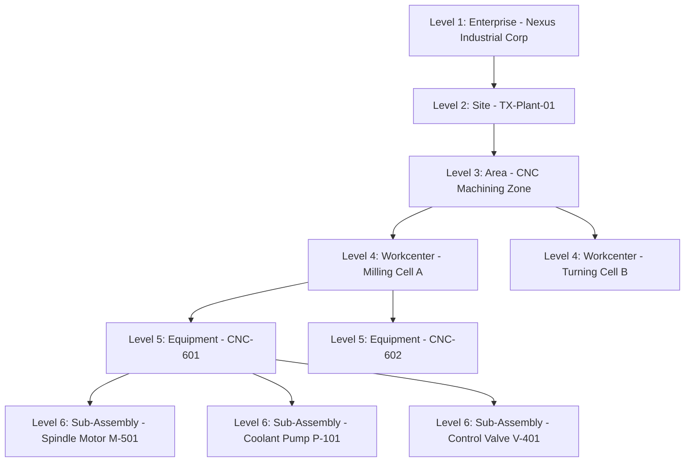

# Nexus Industrial Corp. - Enterprise Profile

> [!NOTE]
> **Confidentiality Level:** Enterprise Public (Simulated)
> **Document Purpose:** Foundational organizational context and structural architecture for the Nexus Industrial Corp. Enterprise AI Platform (Unified Asset & Operations Brain).

---

## 1. Corporate Overview

### 1.1 Company Identity
**Company Name:** Nexus Industrial Corp. (NIC)
**Company Logo Concept:** A stylized, interconnected hexagonal lattice in deep steel blue and vibrant energy orange, representing precision engineering, digital connectivity, and forward-thinking innovation.

### 1.2 Strategic Direction
**Company Mission:** To deliver world-class, sustainable industrial products through relentless innovation, operational excellence, and the seamless integration of advanced manufacturing technologies.
**Company Vision:** To be the global vanguard of Industry 4.0, pioneering autonomous, intelligent manufacturing ecosystems that redefine productivity, safety, and environmental stewardship.

### 1.3 Company History
Founded in 1968 as a regional heavy components supplier, Nexus expanded into precision machining in the 1980s. In 2005, the company underwent a massive transformation, entering the advanced materials and automation sector. Today, it operates globally as a Tier 1 supplier, completing a full digital transformation in 2024 to become a fully connected "smart enterprise."

### 1.4 Manufacturing Footprint
**Manufacturing Sector:** Advanced Discrete & Process Manufacturing.
**Products Manufactured:** High-precision gas turbines, industrial robotic arms, heavy-duty gearboxes, structural aerospace alloys, and smart IIoT sensors.
**Number of Plants:** 14 highly automated manufacturing facilities globally (Key hubs in Germany, USA, Japan, Mexico, and India).

---

## 2. Organization & Operations

### 2.1 Business Units
1. **Aerospace & Defense (A&D):** Precision alloys and turbine components.
2. **Automotive Systems (AutoSys):** Drivetrains and electric vehicle (EV) battery enclosures.
3. **Industrial Automation (IndAuto):** Robotics and automated material handling systems.

### 2.2 Functional Departments
- **Production Department:** Executes manufacturing plans, manages shift operations, and ensures output meets schedule.
- **Maintenance Department:** Responsible for asset uptime, preventive maintenance (PM), and corrective repairs.
- **Reliability Department:** Analyzes asset health, implements Predictive Maintenance (PdM), and conducts Root Cause Analysis (RCA).
- **Quality Department:** Enforces quality control (QC) plans, conducts inspections, and manages non-conformances (NCRs).
- **Safety / EHS Department:** Ensures regulatory compliance, manages incident reporting, and enforces safety protocols (e.g., LOTO).
- **Engineering Department:** Manages CAD models, Process & Instrumentation Diagrams (P&IDs), and Management of Change (MOC).
- **Inventory & Warehousing:** Manages raw materials, finished goods, and spare parts.
- **Procurement Department:** Manages vendor relationships, purchase orders, and supply chain logistics.
- **IT / Digital Transformation Dept:** Maintains enterprise network architecture, cybersecurity, and the overarching AI Data Lake.

### 2.3 Key Employee Roles
- **Plant Manager:** Oversees entire facility operations and P&L.
- **Production Supervisor:** Manages shop floor execution and shift handovers.
- **CNC Machinist / Operator:** Operates high-precision milling and turning centers.
- **Reliability Engineer:** Analyzes vibration, thermography, and oil analysis data.
- **Maintenance Technician:** Executes work orders and replaces faulty components.
- **Quality Inspector:** Verifies product tolerances against engineering specs.
- **EHS Officer:** Conducts safety audits and permits to work.
- **Automation Engineer:** Programs PLCs and robotic cells.
- **Procurement Specialist:** Sources critical spare parts for maintenance.

---

## 3. Plant Assets & Equipment

### 3.1 Equipment Categories
- **Rotating Equipment:** Centrifugal pumps, electric motors, rotary screw compressors.
- **Static Equipment:** Pressure vessels, storage tanks, shell-and-tube heat exchangers.
- **Electrical & Instrumentation (E&I):** Transformers, VFDs (Variable Frequency Drives), PLCs, flow meters, pressure transmitters.
- **Material Handling:** Automated Guided Vehicles (AGVs), overhead bridge cranes, conveyor networks.
- **Processing Machines:** 5-Axis CNC milling centers, 2000-Ton hydraulic forging presses, vacuum heat treatment furnaces.

### 3.2 Major Capital Machines
- **MCH-01:** DMG Mori 5-Axis CNC Machining Center
- **PRS-02:** Schuler 2000-Ton Hydraulic Servo Press
- **FNC-03:** Ipsen Vacuum Heat Treatment Furnace
- **RBT-04:** FANUC 6-Axis Articulated Welding Cell

---

## 4. Standardized Naming Conventions

> [!IMPORTANT]
> To ensure seamless integration with the AI platform, all digital twins, sensor tags, and NLP queries must strictly adhere to the following enterprise naming conventions.

### 4.1 Equipment Naming Convention
**Format:** `<CategoryPrefix>-<IDNumber>`
- Pump → `P-XXX`
- Compressor → `C-XXX`
- Boiler → `B-XXX`
- Valve → `V-XXX`
- Motor → `M-XXX`
- CNC Machine → `CNC-XXX`
- Robot → `RBT-XXX`
- Tank → `TK-XXX`
- Heat Exchanger → `HX-XXX`

### 4.2 Plant Area Naming Convention
**Format:** `<SiteCode>-<BuildingCode>-<ZoneCode>`
*(e.g., `TX-BLD3-ZN2` refers to Texas Plant, Building 3, Zone 2)*

### 4.3 Document Naming Convention
**Format:** `<DocType>-<DeptCode>-<Year>-<SeqNumber>`
*(e.g., `SOP-MNT-2026-0042` refers to a Standard Operating Procedure, Maintenance Dept, created in 2026, sequence 0042)*

### 4.4 Realistic Equipment IDs (Sample of 50)
| Pumps | Compressors | Boilers / Tanks | Valves | Motors | Production Eq. |
|-------|-------------|-----------------|--------|--------|----------------|
| P-101 | C-201       | B-301           | V-401  | M-501  | CNC-601        |
| P-102 | C-202       | B-302           | V-402  | M-502  | CNC-602        |
| P-103 | C-203       | TK-801          | V-403  | M-503  | CNC-603        |
| P-104 | C-204       | TK-802          | V-404  | M-504  | RBT-701        |
| P-105 | C-205       | TK-803          | V-405  | M-505  | RBT-702        |
| P-106 | C-206       | TK-804          | V-406  | M-506  | RBT-703        |
| P-107 | C-207       | TK-805          | V-407  | M-507  | HX-901         |
| P-108 | C-208       | HX-903          | V-408  | M-508  | HX-902         |
| P-109 |             |                 | V-409  | M-509  |                |
| P-110 |             |                 | V-410  | M-510  |                |

---

## 5. Document Architecture & Ownership

Each department within Nexus Industrial Corp. acts as the authoritative owner of specific unstructured and structured data sources.

- **Maintenance Department:** Work Orders, Preventive Maintenance (PM) Reports, Breakdown Reports, Lubrication Logs, Calibration Certificates.
- **Safety (EHS) Department:** Standard Operating Procedures (SOPs), Incident & Near-Miss Reports, Job Hazard Analysis (JHA), Risk Assessments, Safety Data Sheets (SDS), Permits to Work.
- **Quality Department:** Inspection Reports, Non-Conformance Reports (NCR), Corrective and Preventive Action (CAPA) logs, FMEA (Failure Mode and Effects Analysis), Audit Reports, Control Plans.
- **Production Department:** Production Schedules, Batch Records, Shift Handover Logs, OEE (Overall Equipment Effectiveness) Reports.
- **Inventory Department:** Spare Parts Ledgers, Goods Receipt Notes, Cycle Count Reports, Material Transfer Slips.
- **Procurement Department:** Purchase Orders (POs), Vendor Catalogs, RFQs, Supplier SLA Evaluations.
- **Engineering Department:** P&IDs, CAD Drawings, Equipment OEM Specifications, Management of Change (MOC) proposals.
- **Reliability Department:** Reliability-Centered Maintenance (RCM) Analysis, Root Cause Analysis (RCA) Reports, Condition Monitoring / Vibration Data.
- **IT Department:** Network Topologies, Cybersecurity Policies, Data Dictionaries, API Contracts.

---

## 6. Enterprise Information Flow

The "Unified Asset & Operations Brain" relies on understanding how data moves through the organization. A typical cross-departmental flow follows this pattern:

1. **Detection (Production/Reliability):** An operator notices abnormal vibration on `CNC-601` and logs a note in the Shift Handover Log. Simultaneously, the Reliability Department's condition monitoring sensors detect a frequency anomaly.
2. **Action (Maintenance):** Maintenance Department creates a Corrective Work Order (`WO-99842`) to inspect the spindle motor `M-502` on `CNC-601`.
3. **Logistics (Inventory/Procurement):** The Maintenance Tech finds the motor bearing is degraded. They check the Spare Parts Ledger (Inventory). The bearing is out of stock. A request triggers the Procurement Department to issue a Purchase Order (`PO-2026-881`) to an external vendor.
4. **Resolution & Safety:** Once the part arrives, Safety issues a Lockout/Tagout (LOTO) Permit to Work. Maintenance replaces the bearing and closes the WO.
5. **Quality & Continuous Improvement:** The Quality Department runs an Inspection Report on the first batch post-repair to ensure tolerances are met. Reliability analyzes the breakdown to adjust future PM frequencies, and Engineering updates the Equipment Specification if a different bearing type was utilized via an MOC.

---

## 7. Visual Hierarchies & Layouts

### 7.1 Company Hierarchy Diagram

### 7.2 Plant Layout Diagram

### 7.3 Asset Hierarchy

### 7.4 Document Ownership Hierarchy

```mermaid
graph TD
    EnterpriseDocs[Enterprise Knowledge Base]
    
    EnterpriseDocs --> Maint[Maintenance Dept]
    EnterpriseDocs --> Qual[Quality Dept]
    EnterpriseDocs --> Prod[Production Dept]
    EnterpriseDocs --> Safe[Safety / EHS Dept]
    EnterpriseDocs --> SCM[Supply Chain & Procurement]
    
    Maint --> M1[SOP-MNT-001: LOTO Procedure]
    Maint --> M2[PM-REC-2026: Preventative Logs]
    Maint --> M3[WO-84920: Corrective Work Order]
    
    Qual --> Q1[NCR-2026-042: Non-Conformance]
    Qual --> Q2[INSP-REP: Final Inspection Log]
    Qual --> Q3[CTRL-PLAN: Quality Control Plan]
    
    Prod --> P1[SCHED-Wk42: Production Schedule]
    Prod --> P2[OEE-REP: Daily OEE Metrics]
    Prod --> P3[BATCH-994: Batch Record]
    
    Safe --> S1[INC-REP: Near Miss Report]
    Safe --> S2[RISK-ASMT: Cell 4 Risk Assessment]
    Safe --> S3[SDS-001: Material Safety Data Sheet]
```

